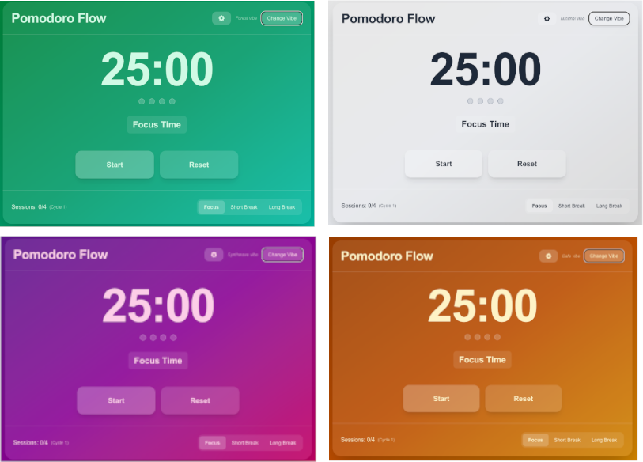
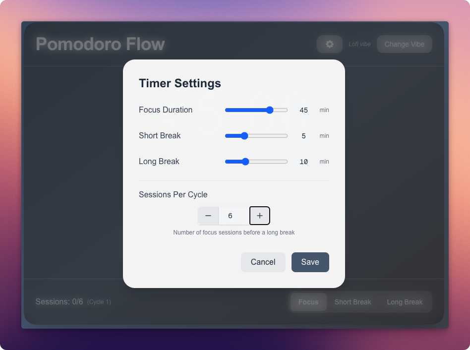

+++
title = "Vibe coding a Pomodoro app with AI"
description = "How I built a personal pomodoro app with vibe coding"
date = "2025-03-15T15:18:12-07:00"
draft = false
tags = ["AI", "LLM", "coding-assistants"]
topics = ["tech-explorations"]
[thumbnail]
    url = "img/main-page.png"
    author = "Ann Catherine Jose"
+++

Today I tried something fun - built a Pomodoro timer app mostly by talking to AI instead of typing code myself. And guess what - there is a term for it - [vibe coding](https://en.wikipedia.org/wiki/Vibe_coding), coined by Andrej Karpathy 😎. 

I have done it a few times before, but this is the first time I am using it to build a full app. I wanted to create something that was useful and worked well, so I chose the Pomodoro timer. Here's how it went and my key takeaways from this way of building products.

## How I Built It
Instead of typing code, I mostly just talked to an LLM through an AI coding assitant - in this case, Claude Sonnet 3.7 with GitHub Copilot in Visual Studio Code and the macOS built-in Dictation app. I'd open the Copilot chat on the right side, simply double press the Fn ke (my shortcut key for dictation app) and I'd simple describe what I want to do, and the LLM would write the code.

Here are a few examples:
> *create a pomodoro timer page with three modes - focus, short break, long break. I want it to have multiple themes the user can choose. There should be a way to start and stop the timer*

> *make the timer duration to be configurable by the user*

> *when the focus time is over, can you do something to alert the user that it is time for a short break*

After each change, I'd check if it was implemented correctly and if it looked good in the app. I'd review the code to see if there are any mistakes. If I want something to change, I'd just tell Copilot to fix - no typing needed. Here are a few examples:

> *change the layout and colors to make it more creative and vibrant*

> *update the theme colors to improve color contrast*

## The Final Result
Using this approach, the app **Pomodoro Flow** has these features...
- Three modes - focus, short break, and long break
- Several color themes (I kept asking for new ones until I found ones I liked)
- A notification popup and sound when the timers finish
- Options to customize timer durations
- Options to customize the number of sessions per cycle
- A debug mode for testing with shorter times

The finished app is deployed at https://my-pomodoro-flow.netlify.app/. You can try it yourself. It's not perfect, but it's pretty good for something I built mostly by talking!

The code is open source and available on GitHub: [https://github.com/annjose/pomodoro-flow](https://github.com/annjose/pomodoro-flow)

In fact, just now, as I am writing this blog post, my app was running in the background in a browser tab and it suddenly made the 'tada' sound to say that my pomodoro session was complete. It is time for a break. So I got up and walked around for 5 min and came back to write.

All of this happened through conversation rather than me writing code directly. I could just sit back, focus on the big picture while my super fast "coding buddy" did all the typing. When the code is ready, I will review and correct. Rinse, repeat.

The conversation being integrated into the IDE makes a huge difference. I've been using Copilot for many months, but the combination of voice input, code generation, and access to the full context of all source files created an experience that felt different - almost magical. This seamless integration is what makes vibe coding truly work.

## What Worked Well

**It was super easy** - I could just sit back and talk easily. While I could have used a more advanced tool like MacWhisper, the built-in Dictation app in macOS served the purpose well.

**Saved tons of time** - Features that would normally take hours happened in minutes. For example, implementing a new theme with animations would typically take me an hour of CSS work, but happened in about 5 minutes with voice commands.

**Got me 80% there** - AI did the heavy-lifting of the mundane work to make the app functional. I still had to do the initial project setup and deployment myself, but these are super easy to do using modern frameworks and platforms like Netlify, Vercel etc.

**Made experimenting painless** - I could try different themes, layouts, features without worrying about wasting code. This made me much more willing to experiment and try creative approaches I might have skipped otherwise.

**The AI was clear and transparent** - It would tell me what it planned to do, then show me what it did. This made the back-and-forth smooth.

**The AI understood context** - It could see all my files and make changes that worked together, maintaining consistency across the codebase.

## What Could Be Better

**It was slower** than typing at times, for example for things I already know well. Many times, my instinct was to type, but then I would switch to voice to stay consistent with the experiment.

**Claude worked better than GPT-4o** for this project. GPT-4o sometimes said it would do something but then didn't. When I asked it to make the UI more fun, it thought for a while but didn't change anything. Claude gave much better results and followed through on requests more consistently.

**Occasional glitches** - Sometimes I got "Sorry, no response" errors. Probably just the Claude model is busy (I get overloaded errors when using Claude through web chat as well).

**Not sufficient yet** - This approach works great for personal projects or prototypes, but shipping large scale products to real customers would need more work on architecture, system design, database, observability and end to end integration. These will evolve very quickly.

## Other Thoughts
The output from Claude through Copilot was pretty similar to what I've seen from Claude.ai web chat. I wondered if there would be big differences due to system prompts, but they seemed fairly similar.

You do need to be comfortable "letting go" - asking the AI to be creative and then reviewing what it comes up with, rather than controlling every detail yourself.

This really feels like the golden age of personal apps. You can make exactly what you want without a huge team or budget.

## What This Means for Developers
I think vibe coding (and AI assisted programming) has fundamentally changed how we build software. It gives you a good starting point - in fact, it will take you almost 70-80% there. But a product or application is much more than just UI and plumbing. There's architecture, systems thinking, and understanding how different components interact. Developers still need to understand these aspects deeply. Without this knowledge, apps built purely through AI prompting will likely be sub-optimal, slow, and hard to maintain.

This is an opportunity and call to action.

As developers, we'll need to be good at:

1. **Giving clear instructions** - Explaining what you want and checking if the code does it right
2. **Reading code** - Understanding and correcting the code written by AI
3. **Thinking about the big picture** - Understanding how all the pieces fit together
4. **Designing good experiences** - As coding gets easier, making things that feel good to use becomes more important
5. **Architecture and optimization** - Ensuring the underlying structure is solid and performance is good

Designers who can learn some basic coding will really shine here. They can direct the AI to build exactly what they envision.

## Tips If You Want to Try This
Work in small steps! Ask the LLM to add one feature, check if it works, save your progress, and then move on to the next feature.

If you try to make too many changes at once, it gets messy and hard to fix things that don't work. Ironically, this brings us back to the old programming advice of making small, focused commits.

## Wrapping Up
Vibe coding isn't going to replace regular coding completely, but it's a fantastic option for quickly making personal projects. Being able to just talk about your ideas and see them turn into working code feels amazing. 

As AI tools get better, we'll see more people building this way. The question will change from "can we build this?" to "what should we build and how should it work?"

I will do this more and more. But I will be diligent about reviewing the work and ensuring that my code is secure, performant and architecturally stable. 

I hope all developers, non-developers will do this too. There is no better time to be in this space!